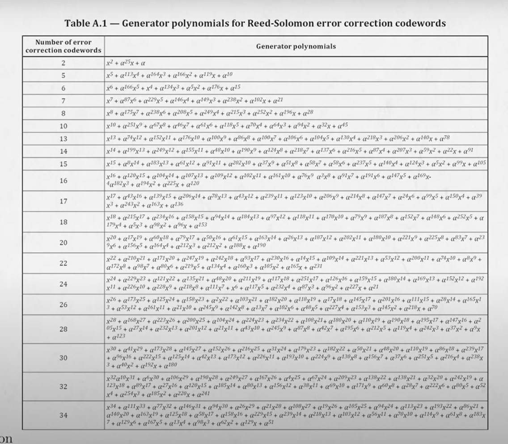

# This project is not finished, and only intend for my learning purpose

## SQL_QR

To create a QR code with SQL - T-SQL

Generating a QR (Quick Response) code. 

Steps and screens from YouTube video 
**[How do QR codes work? (I built one myself to find out)](https://www.youtube.com/watch?v=w5ebcowAJD8)**

Reference - <br>
1. **[Creating a QR Code step by step](https://www.nayuki.io/page/creating-a-qr-code-step-by-step)**

2. **[Thonky.com's QR Code Tutorial](https://www.thonky.com/qr-code-tutorial/module-placement-matrix)**


* convert each character to 010101

```sql
select convert(varchar(4), cast(15 as varbinary(1)), 2)
```

* Make a 21*21 canvas, put four squares on the left upper, right upper and left bottom, and the alignment pattern on the right bottom to adjust angle

* Timing strips. → to tell the phone which version the QR code is 
 
* Format strips → to tell the phone on how to scan the code - the level of error correction
 
* The fixed 0 pixel 

   Writing data from right down, zig-zag up
--> 6.1 On the right bottom 4 cells (2*2), put in one bit for if it’s number, alphanum, binary, kanji..etc
--> 6.2  the next byte is to indicate the number of characters in the message

1. For ECC - Error correction code - Reed-solomon encoding
Low - 7% 
Medium - 15% 
Quartile - 25% 
High - 30% 




--8. Apply the mask,  there could be 8 masking patterns, which was indicated in the format strips
 


