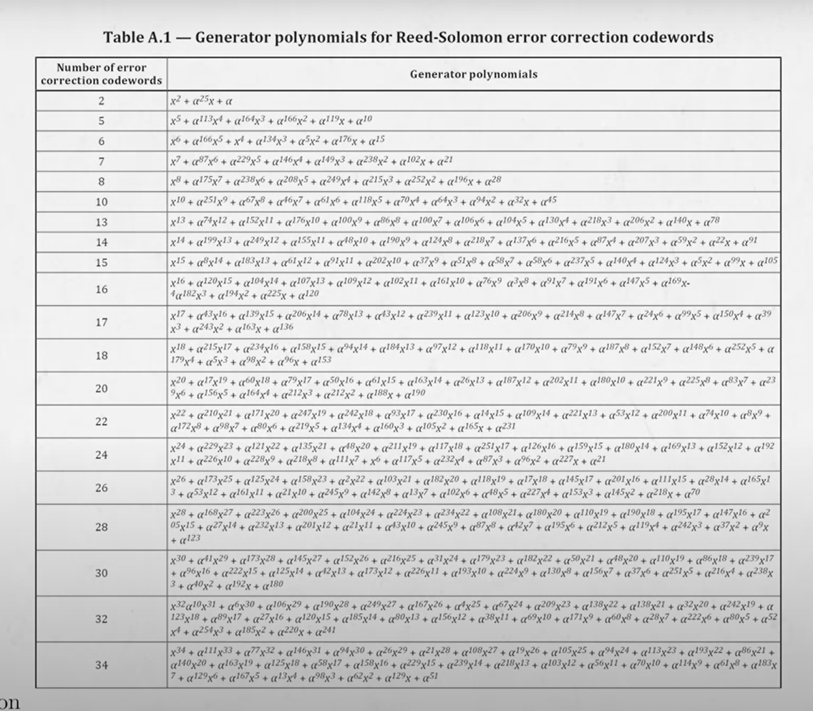
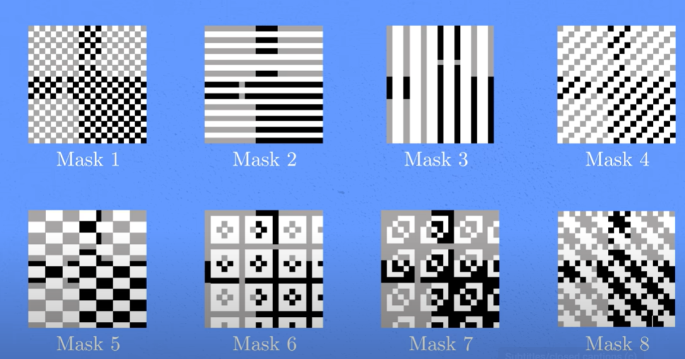

Generating a QR (Quick Response) code. 

Steps and screens from YouTube video 
**[How do QR codes work? (I built one myself to find out)]** https://www.youtube.com/watch?v=w5ebcowAJD8

1. convert each character to 010101

select convert(varchar(4), cast(15 as varbinary(1)), 2)

2. Put four squares on the left upper, right upper and left bottom, and the smaller one on the right bottom to adjust angle

3. Timing strips. → to tell the phone which version the QR code is 

4. Format strips → to tell the phone on how to scan the code - the level of error correction

5. The fixed 0 pixel 

6. Writing data from right down, zig-zag up
--> 6.1 On the right bottom 4 cells (2*2), put in one bit for if it’s number, alphanum, binary, kanji..etc
--> 6.2  the next byte is to indicate the number of characters in the message

7. For ECC - Error correction code - Reed-solomon encoding
Low - 7% 
Medium - 15% 
Quartile - 25% 
High - 30% 

--8. Apply the mask,  there could be 8 masking patterns, which was indicated in the format strips
 

